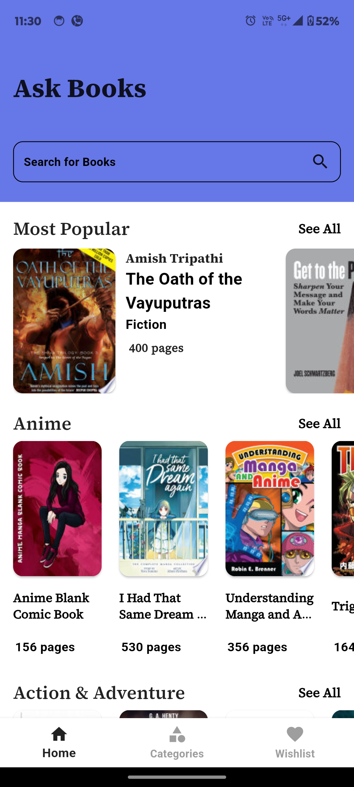
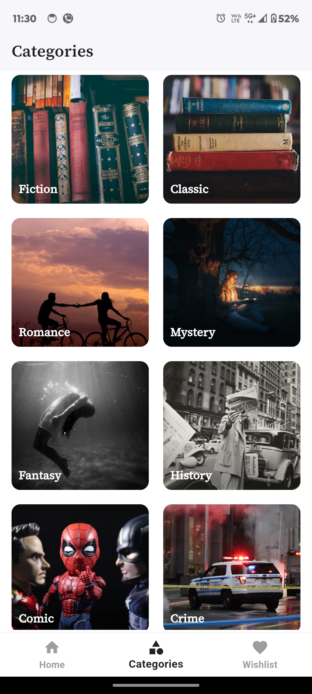
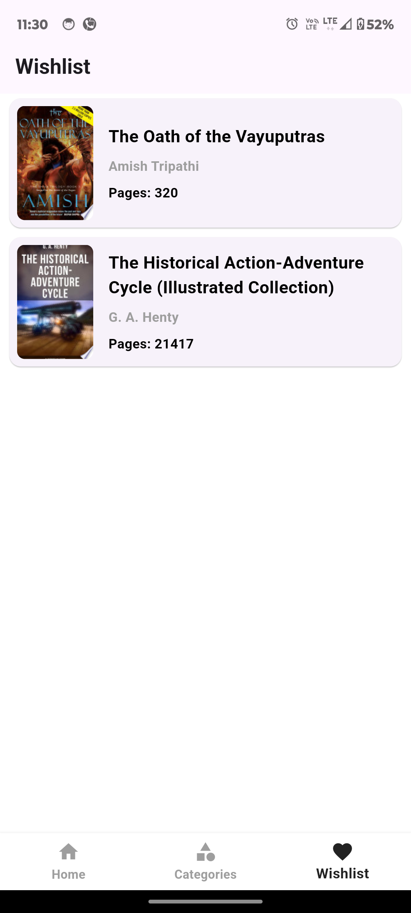
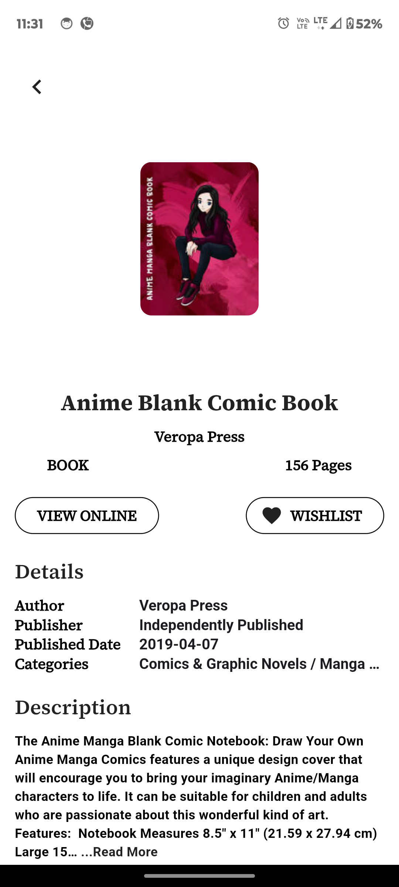

# AskBooks

AskBooks is a mobile application developed using Flutter that allows users to search for books, view their details, and manage a wishlist using the Google Books API.

## Features

*   Book search functionality
*   Detailed book information screen
*   Wishlist functionality with persistence
*   HTML parsing for book descriptions

## Screenshots

   

## Technology and Libraries Used

*   **Flutter:** The framework used to build the application.
*   **Provider:** A state management library for managing the application's state and data flow.
*   **Shared Preferences:** A plugin for storing simple key-value data on the device.
*   **Readmore:** A package for displaying long text with a "Read More" and "Read Less" functionality.
*   **URL Launcher:** A plugin for launching URLs in the device's browser or other appropriate applications.
*   **http:** A package for making HTTP requests to the Google Books API.
*   **html:** A package for parsing HTML content.

## Project Structure

The project follows a standard Flutter structure with the following key directories and files:

*   **lib/**
    *   **Models/**: Contains data models for representing book objects.
    *   **Provider/**: Contains provider classes for managing application state.
    *   **presentation/**: Contains UI components, screens, and widgets.
    *   **main.dart:** The entry point of the application.

## Architecture

AskBooks uses the MVVM (Model-View-ViewModel) architecture.

*   **Model:** Represents the data and business logic of the application. In this project, the `DetailModel` and `Books` classes represent the book data.
*   **View:** Represents the UI of the application. The various screens (Home Screen, Search Screen, Detail Screen, Wishlist Screen) are the views in this project.
*   **ViewModel:** Acts as an intermediary between the Model and the View. The `ApiNotifier` and `WishlistProvider` classes act as the ViewModels in this project, handling data fetching, state management, and user interactions.

## Getting Started

1.  Clone the repository: `git clone https://github.com/Abhayksharma75/askbooks/tree/master`
2.  Install dependencies: `flutter pub get`
3.  Run the app: `flutter run`

